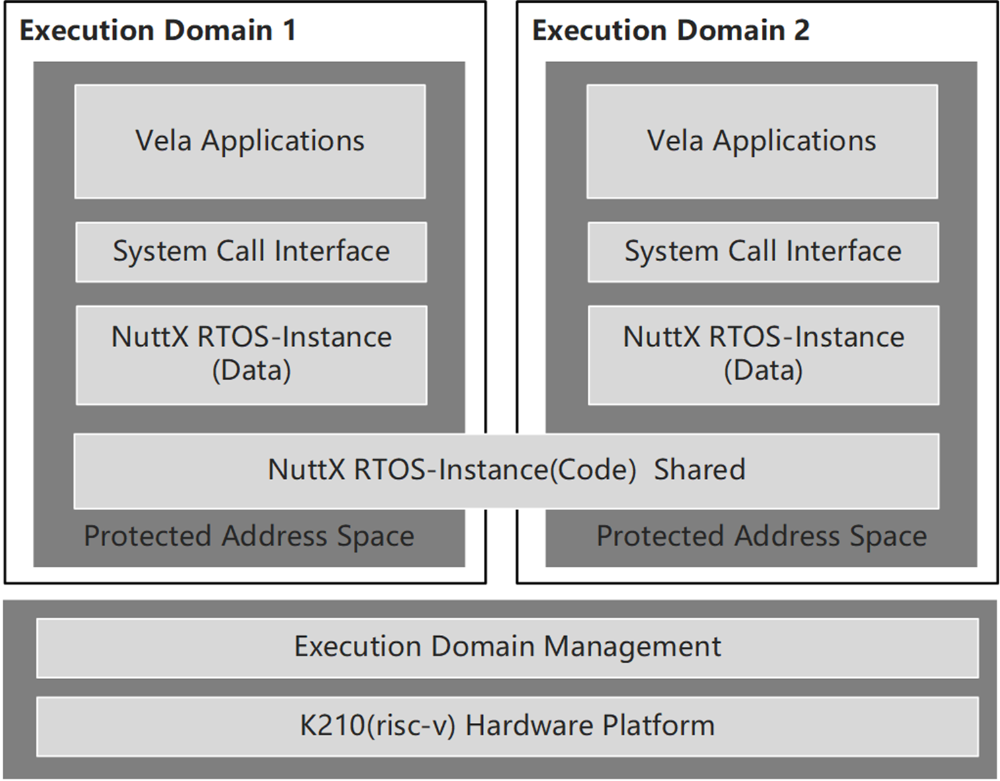

# proj179-xiaomi-nuttx-multidomain

基于小米Vela平台的NuttX RTOS多执行域实现

### 赛题要点/解析

#### 项目介绍

##### 平台介绍

**关于Vela**：[Vela](https://iot.mi.com/vela)是小米公司基于开源实时操作系统NuttX打造的物联网嵌入式软件平台，Vela在各种物联网硬件平台上提供统一的软件服务，支持丰富的组件和易用的框架，用于打通碎片化的物联网应用场景。

**关于NuttX**：[NuttX](https://nuttx.apache.org/docs/latest/)是一个在IoT、分布式嵌入式系统、无人机系统中广泛使用的RTOS，第一个版本由 Gregory Nutt 于 2007 年发布。NuttX 可以支持 8 位到64位的处理器，支持risc-v，arm，mips，x86等主流芯片平台，按照POSIX和 ANSI 标准进行设计，支持MMU和MPU，支持多线程和进程。2019年NuttX在小米的推动下正式进入Apache基金会，小米多位资深工程师参与了[NuttX社区](https://github.com/apache/incubator-nuttx)的开发和架构设计。经过多年的不懈努力，NuttX功能丰富，性能稳定，商业化成熟度高，在各种物联网产品上得到了广泛的应用。

##### 命题背景

当前，智能汽车已列为我国的发展战略之一，是未来10年国家大力发展的支柱产业之一。而在汽车行业，国际标准化组织的功能安全性标准ISO26262在车机的软硬件系统中得到了广泛的接受和应用。其中，标准的第6部分中对软件的功能安全性机制做了标准定义，提出了3种保证软件互不干扰（freedom from interference）的机制标准，包括：

￮ 时序和执行安全性（Timing and execution）

￮ 内存保护安全性（Memory）

￮ 信息交换（Exchange of information）

要达到这样的要求，需要在RTOS的软件架构层面上需要做出调整以进行适应。本项目引入执行域的概念，以Vela平台和NuttX实时操作系统为软件平台基础，结合大赛所提供的K210硬件平台（NuttX RTOS已经完整支持K210板卡），实现执行域的概念，对功能安全性的几个要求从架构上进行保证，以此基础来满足RTOS的功能安全设计要求。

#### 功能点

注：所有功能点应能在K210板卡上运行并演示

软件架构图

##### 功能点要求

• 执行域管理负责各个执行域的创建，执行，加载和管理，以及执行域之间的通信机制

• 不同的执行域运行不同的NuttX RTOS实例，各个RTOS域之间具备独立的线程调度和执行空间

• 但每个RTOS实例之间的代码段共享

• NuttX OS实例之间充分隔离，运行在不同的执行保护地址空间中（可以用MMU或MPU实现）

• 每个执行域之间应做到弱耦合，某个执行域的崩溃，退出等异常不能影响其余执行域中实例的运行和调度，并应提供对该执行域的重启机制

##### 扩展功能点

• 在实现执行域的基础上，参考AUTOSAR和ISO26262，在NuttX上实现针对软件功能安全所定义的一种或几种安全机制

### 项目导师

• 接口人：秦蔚，qinwei1@xiaomi.com

• 小米公司Vela研发团队（含NuttX社区主要代码提交人）、

#### 难度

中等~高

#### 文档

• https://nuttx.apache.org/docs/latest/ ：NuttX的最新文档，可以直接下载并按照要求配置和使用K210板卡

• https://github.com/apache/incubator-nuttx/tree/master/boards/risc-v/k210/maix-bit ：NuttX文档中对K210板卡的配置和使用说明

• iso26262标准，Part6

• Overview of Functional Safety Measures in AUTOSAR: https://www.autosar.org/fileadmin/user_upload/standards/classic/21-11/AUTOSAR_EXP_FunctionalSafetyMeasures.pdf

#### 参考代码

• https://github.com/apache/incubator-nuttx/ ：目前Nuttx针对K210板卡具备完整支持，参赛者可在此基础上进行后续开发

#### 预期目标

注意：下面的内容是建议内容，不要求必须全部完成。选择本项目的同学也可与导师联系，提出自己的新想法，如导师认可，可加入预期目标

• 第一题：完成执行域的启动和加载，每个执行域可独立运行并输出log;

• 第二题：设计并指定一个主执行域，该执行域可用shell串口进入，并通过rpmsg的console通道查看别的执行域内部运行情况

• 第三题：根据对iso26262和autosar标准的理解，实现其中的1~3种功能安全机制

### 对选择该赛题的支持

• 针对NuttX实时操作系统和Vela平台业界最专业权威的技术支持和指导

• 我们希望参赛团队根据自己的理解和思路，完成相关的代码架构设计，我们可以进行代码架构的评估和建议和以及针对NuttX修改思路上的指导
